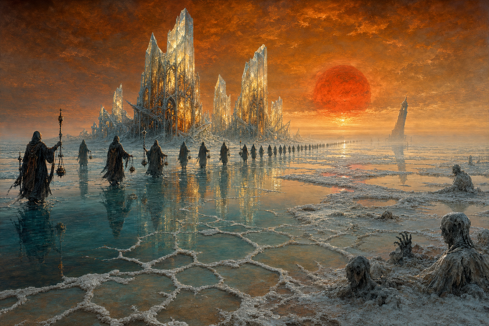

# The Litany Sea

## A war over the nature of truth, fought with salt and brine on the corpse of a god, with a clock everyone can hear.

--------------------------------------------------------------------------------

## About

This repo generates an illustrated tabletop-wargame rulebook as **`.docx` → `.pdf`**.
The book is *content-as-data*: a JSON file holds the world/factions/scenarios, a Python
script lays it out, and an `assets/` folder holds the artwork. You edit the data (and/or
the layout/art), then re-run the pipeline.

- **Game system:** **SIXES** — a fast D6 skirmish game (one target number, alternating
  activations, 2 actions/model). The core rules are static text inside `sixes_book.py`.
- **Setting:** **The Litany Sea** — a war over the nature of truth on the drying wound of a
  grieving god; objectives are fragile memory-crystals you must capture *without shattering
  them*, under a shared receding-tide doomsday clock. Four asymmetric factions that each
  *score differently*: Mnemarchs (Set crystals), Ash Iconoclasts (Shatter), Brine-Factors
  (Sell), Sediment (Re-Dream / swarm).

See AGENTS.md for more information on how to build/update the rulebook.
